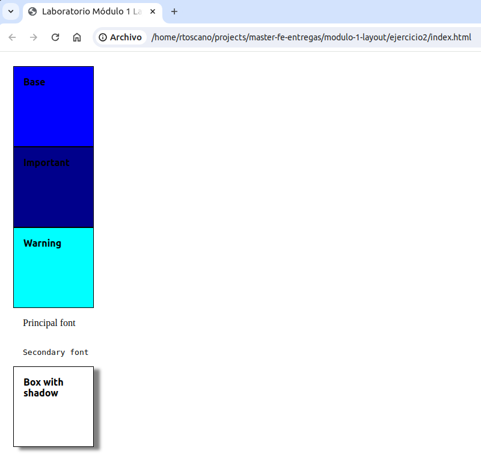

# Laboratorio Módulo 1 Layout

## Ejercicio 1: Crear una paleta de colores dinámica.

### Enunciado

Usar el lenguaje Sass para crear distintos temas de paletas de colores.
La idea es partir de un color base, y a partir de ese color generar 4 colores más oscuros de manera gradual, y cuatro colores más claros de manera gradual.


### Resultado

- Descargar carpeta ejercicio1.
- Abrir terminal en carpeta raíz.
- Ejecutar 
    ```
    npm init
    npx parcel src/index.html
    ```

- Abrir en navegador según el puerto indicado por Parcel. Por ejemplo: http://localhost:1234


- El resultado debería ser el siguiente:


## Ejercicio 2: Crear dos temas distintos y mostrar los resultados en una página.

### Enunciado

Crear dos temas distintos y mostrar los resultados en una página.


### Resultado

#### Visualizar Tema A

- Editar el fichero index.html. 
- Actualizar el enlace a la hoja de estilo con el tema A:

    ```
    <link rel="stylesheet" href="mystyle-themeA.css">
    ```
- Abrir el fichero index.html en un navegador. 

    


#### Visualizar Tema B

- Editar el fichero index.html. 
- Actualizar el enlace a la hoja de estilo con el tema B:

    ```
    <link rel="stylesheet" href="mystyle-themeB.css">
    ```
- Abrir el fichero index.html en un navegador. 
    


## Ejercicio 3: Crear la barra de navegación de la imagen usando Flexbox.

### Enunciado
Crear la barra de navegación de la imagen usando Flexbox.
La barra de navegación responde a distintas resoluciones. Utilizar media queries para conseguir este resultado.


### Resultado

Se ha utilizado un diseño responsivo Desktop first.

Me falta revisar el punto de breakpoint y poner un minimo al reducir pantalla


## Ejercicio 4: Crearemos un elemento de tipo card con Grid CSS.

Pendiente:
refactorizar uso de font atributos


me queda: centrar foto y poner pading a contenido y botón.
Revisar responsividad